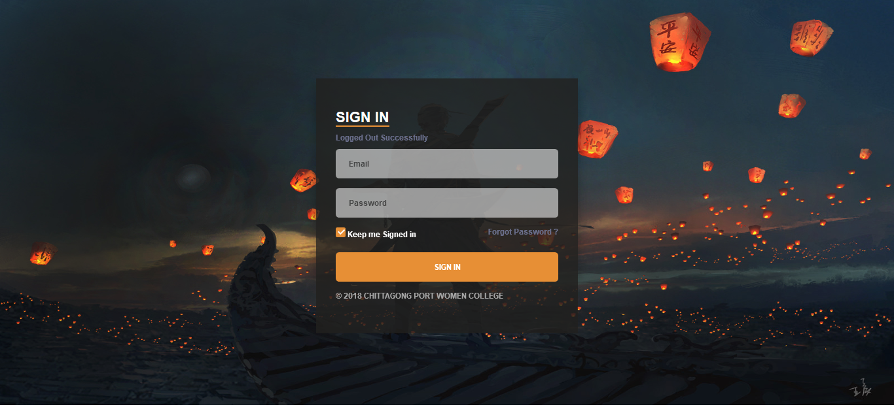
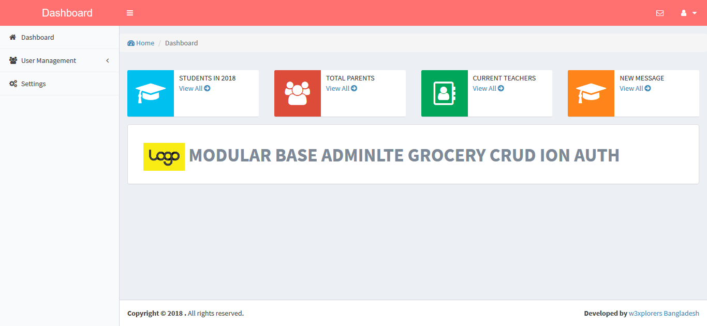
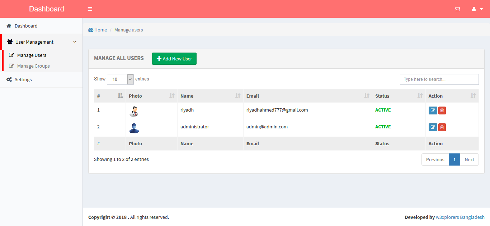
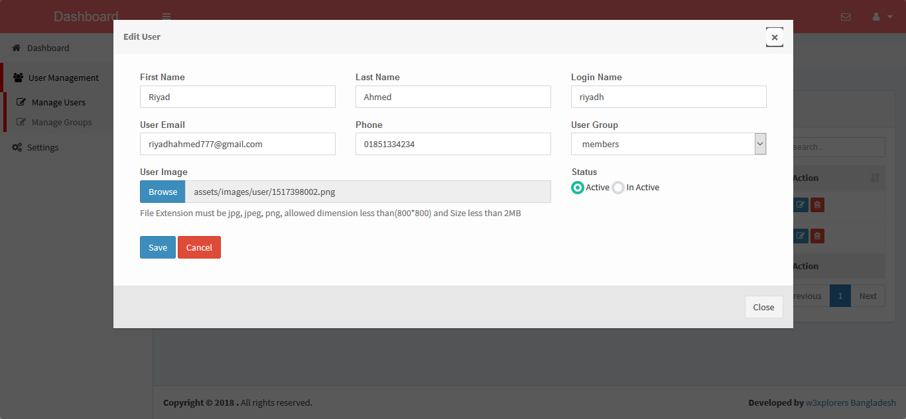
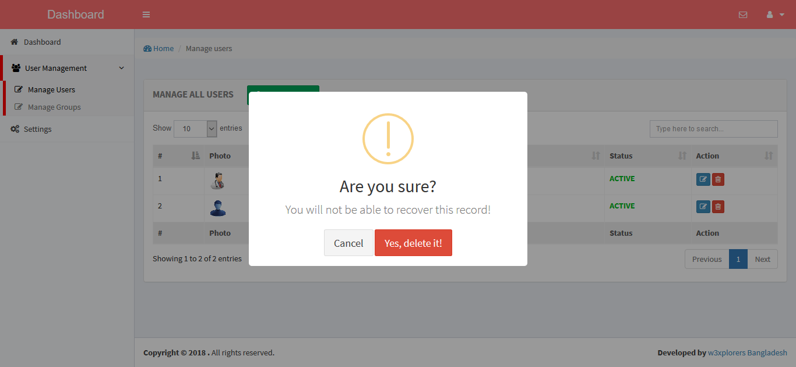
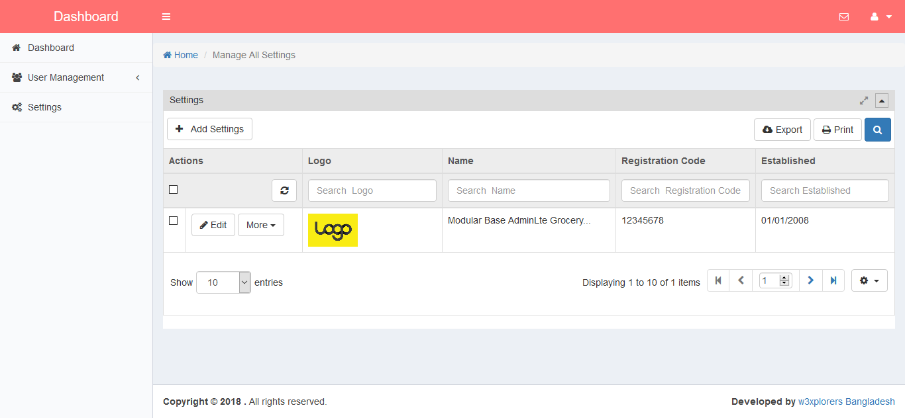

<h1>Modularbase codeigniter Adminlte admin panel with grocery crud, ion auth and many more </h1> 

To run this project please follow below steps :   

1. At first download the project   
2. Then extract it in xampp/htdocs folder  
3. You have to download ci frame work and copy system folder to this project  
4. Create database and import sql file from toot db directory  
5. Change your ase url in config file  
6. Configure database file  

  Admin username and password   

  username : admin@admin.com  
  pass : admin123

Output : 

 Find me on Facebook  : [ My Facebook profile link](https://www.facebook.com/morshed.riyad) \
 Find me on  Linkedin  : [My Linkedin profile  link](https://www.linkedin.com/in/monjur-morshed-riyadh-6aaba465/)  \
 Email me : riyadhahmed777@gmail.com